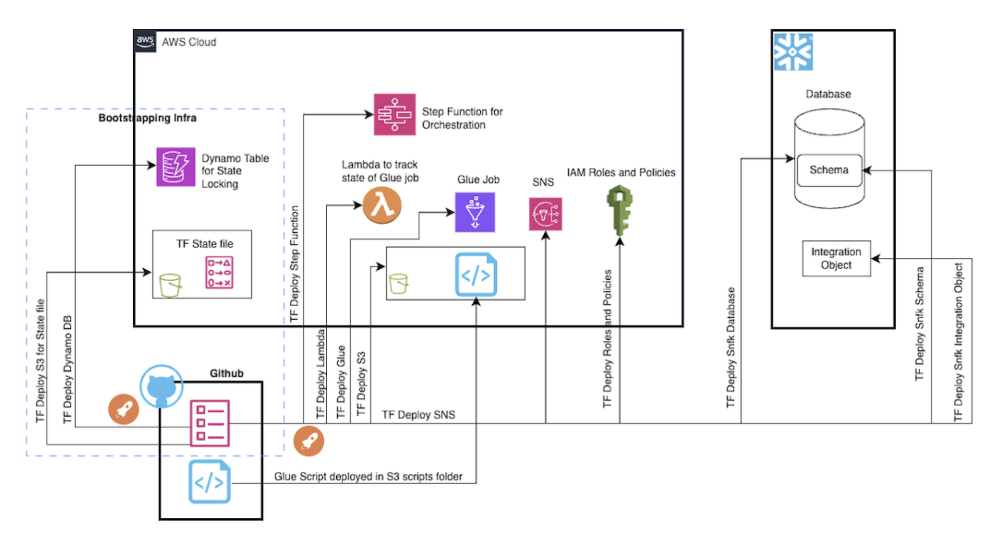
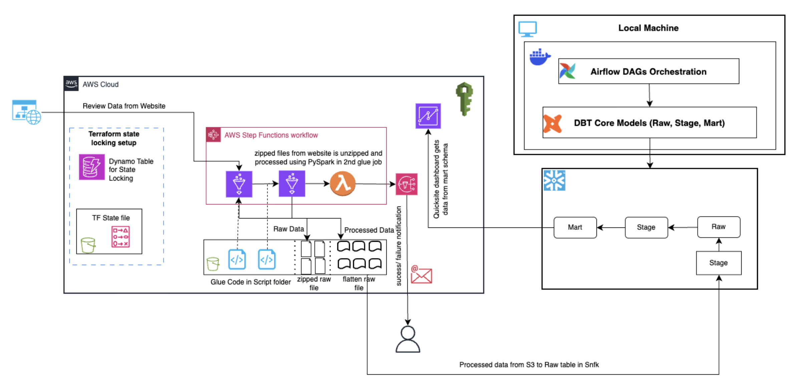
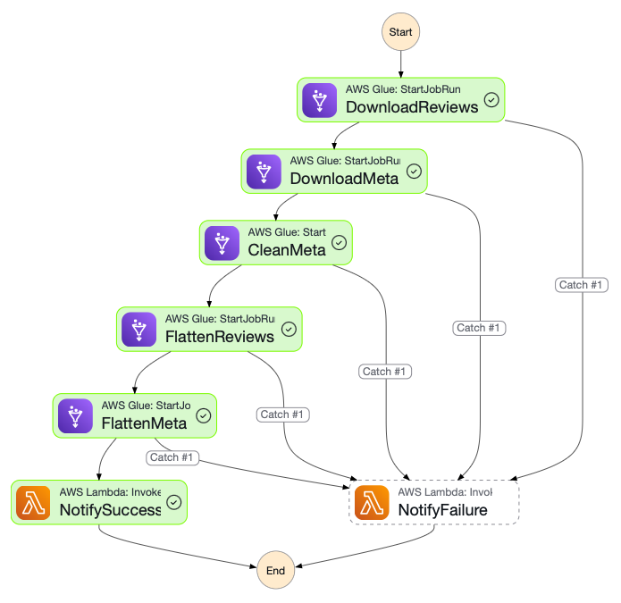
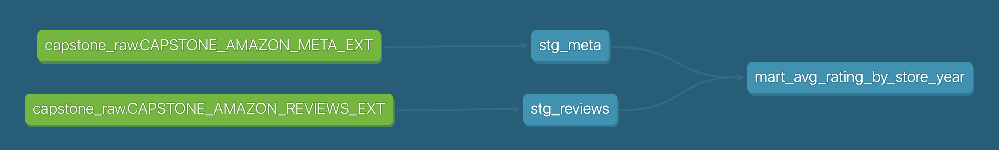

# Capstone Project — Amazon Product Review Analytics

End-to-end pipeline that creates infrastructure, ingests [Amazon Reviews + Metadata](https://amazon-reviews-2023.github.io), flattens to Parquet, lands in S3, exposes Snowflake external tables, transforms with dbt, and orchestrates with Airflow.

## Architecture
- **Create infrastructure**: Terraform creates all objects in AWS and Snowflake.
- **Ingest**: Glue Python Shell downloads JSONL.GZ to S3 `raw/`.
- **Clean meta**: Glue Python Shell normalizes metadata keys and dedupes.
- **Flatten**: Glue Spark job writes Parquet to `flattened/`.
- **Orchestrate Glue**: Step Function runs download → clean meta → flatten.
- **Warehouse**: Snowflake external tables point to Parquet in S3.
- **Transform**: dbt connects to source tables, creates staging and analysis-ready marts model.
- **Orchestrate dbt**: Airflow polls Step Functions and runs dbt.

## Infrastructure (Terraform)



### Bootstrap remote state
```bash
cd bootstrap
terraform init
terraform plan
terraform apply -auto-approve
```
Update `modules/env/dev/backend.tf` with outputs.

### Local apply
```bash
cp .env.example .env
set -a
source .env
set +a

cd modules/env/dev
terraform init
terraform plan
terraform apply
```

### Required TF vars
Set these in `.env` (or shell):
- `TF_VAR_reviews_url`
- `TF_VAR_meta_url`
- `TF_VAR_sns_email`
- Snowflake key-pair vars and integration outputs

### Snowflake S3 integration (two-pass apply)
1) `terraform apply`
2) Read outputs:
   - `snowflake_integration_iam_user_arn`
   - `snowflake_integration_external_id`
3) Export and re-apply:
```bash
export TF_VAR_snowflake_iam_user_arn="..."
export TF_VAR_snowflake_external_id="..."
terraform apply
```

## GitHub Actions (alternative to local Terraform)
Workflows:
- `terraform-bootstrap.yml` — creates S3/DynamoDB backend
- `terraform.yml` — plans/applies the main stack (apply when input `APPLY`)
- `terraform-destroy.yml` — destroys the stack (requires `DESTROY` confirmation)
- `stepfunctions-run.yml` — triggers the Step Functions pipeline from GitHub

Required GitHub Secrets:
- `AWS_ACCESS_KEY_ID`
- `AWS_SECRET_ACCESS_KEY`
- `AWS_REGION`
- `SNOWFLAKE_ACCOUNT`
- `SNOWFLAKE_USER`
- `SNOWFLAKE_PRIVATE_KEY`
- `SNOWFLAKE_ROLE`
- `SNOWFLAKE_WAREHOUSE`
- `SNOWFLAKE_IAM_USER_ARN` (after first apply)
- `SNOWFLAKE_EXTERNAL_ID` (after first apply)
- `SNS_EMAIL`
- `STATE_MACHINE_ARN`

Required GitHub Variables:
- `REVIEWS_URL`
- `META_URL`

Note: run bootstrap first. Run the main workflow twice to complete the Snowflake integration trust policy.

## Pipeline overview


## Glue Jobs
Scripts:
- `glue_jobs/download_from_url.py` — downloads dataset files to S3 if not present.
- `glue_jobs/clean_jsonl_keys.py` — normalizes metadata keys and dedupes.
- `glue_jobs/flatten_jsonl_to_parquet.py` — Spark job to write Parquet.

Flow:
1) Download reviews + meta
2) Clean meta
3) Flatten reviews + meta to `flattened/`

## Step Functions
State machine runs:
1) Download reviews
2) Download meta
3) Clean meta
4) Flatten reviews
5) Flatten meta
6) Notify SNS via Lambda (success/failure)



## Lambda
`lambda/publish_sns.py` publishes Step Functions outcomes to SNS.

## dbt

### Docker image
```bash
cd dbt
docker build -t your-docker-username/amazon-reviews-dbt:latest .
```

Test:
```bash
docker run --rm -it \
  -e SNOWFLAKE_PRIVATE_KEY="$(../scripts/encode_private_key.sh ../snowflake_rsa_key.pem)" \
  your-docker-username/amazon-reviews-dbt:latest \
  dbt debug --project-dir /app/reviews_pipeline_orchestration --profiles-dir /root/.dbt
```

### Project layers
- **sources**: External tables
- **staging** (`CAPSTONE_AMAZON_STG`): parsed fields from raw VARIANT
- **marts** (`CAPSTONE_AMAZON_MART`): aggregated analytics

Models:
- `stg_reviews`
- `stg_meta`
- `mart_avg_rating_by_store_year`

Run locally:
```bash
cd dbt/reviews_pipeline_orchestration
dbt debug
dbt run -s staging
dbt run -s marts
```

dbt docs lineage graph:


## Airflow

DAGs:
- `capstone_dbt_polling` (`airflow/dags/dbt_pipeline_polling.py`)
  - Connects to dockerized dbt image via DockerOperator.
  - Initiates a new run every hour, within which polls Step Functions every 5 minutes and runs dbt tasks on success.
  - Uses Airflow Variable `capstone_latest_execution_arn` to ensure the new successful execution was read to avoid reruns.
- `capstone_dbt` (`airflow/dags/dbt_pipeline_trigger.py`)
  - Version without polling, requires manual trigger.

Required env vars (in `airflow/.env`):
- `AWS_ACCESS_KEY_ID`
- `AWS_SECRET_ACCESS_KEY`
- `AWS_REGION`
- `STATE_MACHINE_ARN`
- `SNOWFLAKE_PRIVATE_KEY`
- `DBT_DOCKER_IMAGE`
- `DBT_DOCS_DIR` (host path for the mounted volume of dbt docs)

Run locally:
```bash
cd airflow
docker compose up -d
```

Serve dbt docs:
```bash
cd DBT_DOCS_DIR               # use the host path
python3 -m http.server 8088   # you can choose other port number
```

Restart after env changes:
```bash
docker compose down
docker compose up -d
```

DAG graph:

