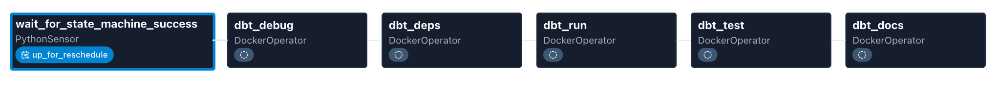

# Airflow Orchestration

Local Docker-based Airflow stack that polls Step Functions and runs dbt inside a Docker image.

## DAGs
- `capstone_dbt_polling_debug` (`dags/dbt_pipeline.py`)
  - Polls the latest Step Functions execution and runs dbt tasks on success.
  - Uses an Airflow Variable `capstone_latest_execution_arn` to avoid reruns.
- `capstone_dbt_debug` (`dags/dbt_capstone_debug.py`)
  - Manual dbt debug only.

## DAG flow


## Required env vars (.env)
These must be available to the scheduler:
- `AWS_ACCESS_KEY_ID`
- `AWS_SECRET_ACCESS_KEY`
- `AWS_REGION`
- `STATE_MACHINE_ARN`
- `SNOWFLAKE_PRIVATE_KEY`
- `DBT_DOCKER_IMAGE` (optional; defaults to `deelenv/amazon-reviews-dbt:latest`)

## Run locally
```bash
docker compose up -d
```
Restart after any `.env` change:
```bash
docker compose down
docker compose up -d
```

## Notes
- The polling DAG runs every 15 minutes; adjust `schedule` as needed.
- The scheduler must have AWS creds to call Step Functions.
